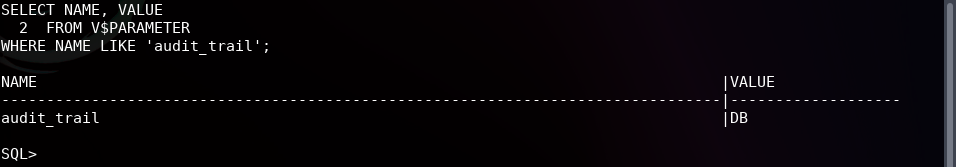
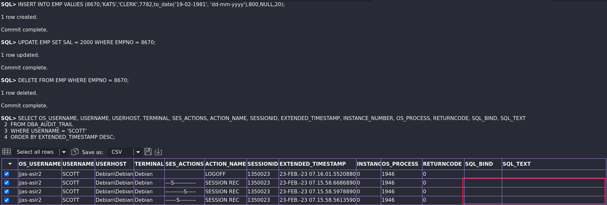
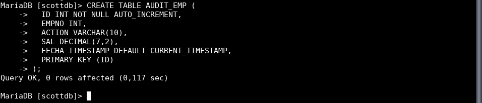
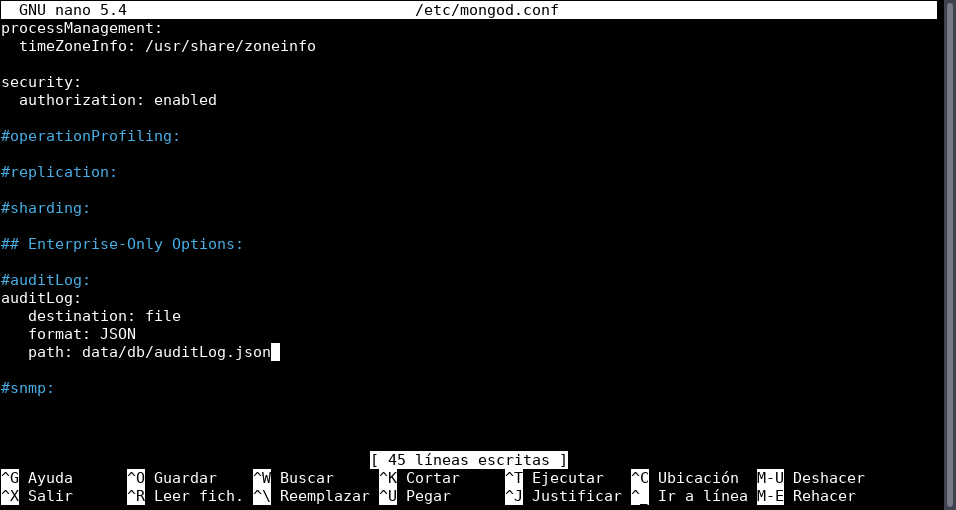

# **ASGBD - Práctica 5: Auditoría**

**Tabla de contenidos:**

- [**ASGBD - Práctica 5: Auditoría**](#asgbd---práctica-5-auditoría)
  - [**Preparación del escenario en la VM con Oracle**](#preparación-del-escenario-en-la-vm-con-oracle)
  - [**Ejercicio 1**](#ejercicio-1)
  - [**Ejercicio 2**](#ejercicio-2)
  - [**Ejercicio 3**](#ejercicio-3)
  - [**Ejercicio 4**](#ejercicio-4)
  - [**Ejercicio 5**](#ejercicio-5)
  - [**Ejercicio 6**](#ejercicio-6)
  - [**Ejercicio 7**](#ejercicio-7)
    - [**Ejercicio 7.1**](#ejercicio-71)
    - [**Ejercicio 7.2**](#ejercicio-72)
    - [**Ejercicio 7.3**](#ejercicio-73)
    - [**Ejercicio 7.4**](#ejercicio-74)
  - [**Ejercicio 8**](#ejercicio-8)
    - [**Ejercicio 8.1**](#ejercicio-81)
    - [**Ejercicio 8.3**](#ejercicio-83)
    - [**Ejercicio 8.4**](#ejercicio-84)
  - [**Preparación del escenario en la VM para MongoDB**](#preparación-del-escenario-en-la-vm-para-mongodb)
  - [**Ejercicio 9**](#ejercicio-9)
  - [**Ejercicio 10**](#ejercicio-10)
  - [**Extra**](#extra)

---

## **Preparación del escenario en la VM con Oracle**

1. Entrar en SQLPlus como administrador.

    ```bash
    sqlplus / as sysdba
    ```

2. Habilitar el modo script y la salida por pantalla:

    ```sql
    ALTER SESSION SET "_ORACLE_SCRIPT"=TRUE;
    SET SERVEROUT ON;
    ```

## **Ejercicio 1**

> **1. Activa desde SQL*Plus la auditoría de los intentos de acceso exitosos al sistema. Comprueba su funcionamiento.**

Para habilitarla desde SQLPlus, primero habilito la auditoría, para ello ejecuto el siguiente comando:

```sql
ALTER SYSTEM SET AUDIT_TRAIL=DB SCOPE=SPFILE;
```


Reinicio el servicio de Oracle para que se apliquen los cambios:

```sql
SHUTDOWN IMMEDIATE;

STARTUP;
```

Para comprobar que está activada, ejecutamos el siguiente comando:

```sql
SELECT NAME, VALUE
FROM V$PARAMETER
WHERE NAME LIKE 'audit_trail';
```



Con la auditoría activada, ya puedo habilitarla para los accesos exitosos, para ello ejecuto el siguiente comando:

```sql
AUDIT CREATE SESSION BY ACCESS;
```


Finalmente, compruebo que funciona conectándome con varios usuarios que existen en la base de datos:


Y si ahora me conecto como administrador y reviso la vista *DBA_AUDIT_SESSION*, veré que se han registrado los accesos, en este caso seleccionaré algunas columnas ya que no me interesa la información de todas:

```sql
SELECT OS_USERNAME, USERNAME, USERHOST, TERMINAL, TIMESTAMP, ACTION_NAME, SESSIONID, EXTENDED_TIMESTAMP, INSTANCE_NUMBER, OS_PROCESS
FROM DBA_AUDIT_SESSION
WHERE ACTION_NAME = 'LOGON';
```


Debido a las limitaciones de SQL*Plus para mostrar la información, la salida es un poco complicada de interpretar, si ejecuto la sentencia desde *VSCode*, la salida es mucho más clara:


Podemos ver como se han registrado los accesos de los diferentes usuarios que he utilizado para la prueba así como bastantes datos relevantes a la conexión.

> Nota: Para deshabilitar la auditoría, ejecutar el siguiente comando:
>
> ```sql
> ALTER SYSTEM SET AUDIT_TRAIL=NONE SCOPE=SPFILE;
> ```

## **Ejercicio 2**

> **2. Realiza un procedimiento en PL/SQL que te muestre los accesos fallidos junto con el motivo de los mismos, transformando el código de error almacenado en un mensaje de texto comprensible. Contempla todos los motivos posibles para que un acceso sea fallido.**

Primero, activaré la auditoría de accesos fallidos:

```sql
AUDIT CREATE SESSION WHENEVER NOT SUCCESSFUL;
```


Para probarlo, me conecto con un par de usuarios y contraseñas incorrectas:


Ahora, realizo la siguiente consulta para ver los accesos fallidos:

```sql
SELECT *
FROM DBA_AUDIT_SESSION
WHERE ACTION_NAME='LOGON'
AND RETURNCODE != 0
ORDER BY TIMESTAMP;
```


Sabiendo ya que la consulta funciona, procedo a crear una función para devolver el mensaje de error correspondiente a cada código:

```sql
CREATE OR REPLACE FUNCTION F_OBTENER_MENSAJE_ERROR(P_CODIGO_ERROR IN NUMBER) RETURN VARCHAR2 IS
  VV_MENSAJE VARCHAR2(200);
BEGIN
  CASE P_CODIGO_ERROR
    WHEN 911 THEN VV_MENSAJE := 'Carácter inválido.';
    WHEN 988 THEN VV_MENSAJE := 'Falta la contraseña o es inválida.';
    WHEN 1004 THEN VV_MENSAJE := 'Usuario por defecto no soportado, inicio de sesión denegado.';
    WHEN 1005 THEN VV_MENSAJE := 'Contraseña nula, inicio de sesión denegado.';
    WHEN 1017 THEN VV_MENSAJE := 'Usuario/contraseña inválida.';
    WHEN 1045 THEN VV_MENSAJE := 'El usuario carece el privilegio CREATE SESSION, inicio de sesión denegado.';
    WHEN 1918 THEN VV_MENSAJE := 'No existe el usuario.';
    WHEN 1920 THEN VV_MENSAJE := 'El nombre de usuario entra en conflicto con otro usuario o nombre de rol.';
    WHEN 9911 THEN VV_MENSAJE := 'Contraseña incorrecta.';
    WHEN 28000 THEN VV_MENSAJE := 'La cuenta está bloqueada.';
    WHEN 28001 THEN VV_MENSAJE := 'La contraseña ha expirado.';
    WHEN 28002 THEN VV_MENSAJE := 'Su contraseña expirará pronto.';
    WHEN 28003 THEN VV_MENSAJE := 'La verificación de contraseña para la falló.';
    WHEN 28007 THEN VV_MENSAJE := 'La contraseña no puede reutilizarse.';
    WHEN 28008 THEN VV_MENSAJE := 'Contraseña antigua incorrecta.';
    WHEN 28009 THEN VV_MENSAJE := 'La conexión a SYS debe hacerse como SYSDBA o SYSOPER.';
    WHEN 28011 THEN VV_MENSAJE := 'La contraseña ha expirado.';
  ELSE
    VV_MENSAJE := 'Error no contemplado. Código de error: ' || P_CODIGO_ERROR;
  END CASE;
  RETURN VV_MENSAJE;
END F_OBTENER_MENSAJE_ERROR;
/
```


```sql
-- Comprobación del funcionamiento:
SELECT F_OBTENER_MENSAJE_ERROR(28000) FROM DUAL;

SELECT F_OBTENER_MENSAJE_ERROR(98472) FROM DUAL;
```


Finalmente, creo el procedimiento principal:

```sql
CREATE OR REPLACE PROCEDURE P_OBTENER_ACCESOS_FALLIDOS IS
  CURSOR C_ACCESOS IS
    SELECT OS_USERNAME, USERNAME, USERHOST, TERMINAL, TIMESTAMP, ACTION_NAME, SESSIONID, EXTENDED_TIMESTAMP, INSTANCE_NUMBER, OS_PROCESS, RETURNCODE
    FROM DBA_AUDIT_SESSION
    WHERE ACTION_NAME = 'LOGON'
    AND RETURNCODE != 0
    ORDER BY TIMESTAMP;
  VV_MENSAJE_ERROR VARCHAR2(200);
  VN_CONTADOR NUMBER := 1;
BEGIN
  FOR R_ACCESO IN C_ACCESOS LOOP
    DBMS_OUTPUT.PUT_LINE('------------------------------------------' || CHR(10) || 'Acceso fallido número: ' || VN_CONTADOR);
    VV_MENSAJE_ERROR := F_OBTENER_MENSAJE_ERROR(R_ACCESO.RETURNCODE);
    DBMS_OUTPUT.PUT_LINE('- Usuario del sistema: ' || R_ACCESO.OS_USERNAME || CHR(10) || '- Usuario de la base de datos: ' || R_ACCESO.USERNAME || CHR(10) || '- Host: ' || R_ACCESO.USERHOST || CHR(10) || '- Terminal: ' || R_ACCESO.TERMINAL || CHR(10) || '- Fecha y hora: ' || R_ACCESO.TIMESTAMP || CHR(10) || '- Acción: ' || R_ACCESO.ACTION_NAME || CHR(10) || '- ID de sesión: ' || R_ACCESO.SESSIONID || CHR(10) || '- Fecha y hora extendida: ' || R_ACCESO.EXTENDED_TIMESTAMP || CHR(10) || '- Número de instancia: ' || R_ACCESO.INSTANCE_NUMBER || CHR(10) || '- ID del proceso del sistema operativo: ' || R_ACCESO.OS_PROCESS || CHR(10) || '- Código de error: ' || R_ACCESO.RETURNCODE || CHR(10) || '- Mensaje de error: ' || VV_MENSAJE_ERROR);
    VN_CONTADOR := VN_CONTADOR + 1;
  END LOOP;
END P_OBTENER_ACCESOS_FALLIDOS;
/
```


```sql
-- Comprobación del funcionamiento:
EXEC P_OBTENER_ACCESOS_FALLIDOS;
```


## **Ejercicio 3**

> **3. Activa la auditoría de las operaciones DML realizadas por SCOTT. Comprueba su funcionamiento.**

Para activar esta auditoría ejecuto la siguiente instrucción:

```sql
AUDIT INSERT TABLE, UPDATE TABLE, DELETE TABLE BY SCOTT BY ACCESS;
```


Me conecto como el usuario SCOTT y realizo algunas operaciones DML:

```sql
INSERT INTO EMP VALUES (8000,'EVA01','CLERK',7782,to_date('19-02-1981','dd-mm-yyyy'),800,NULL,20);

UPDATE EMP SET SAL = 2000 WHERE EMPNO = 8000;

DELETE FROM EMP WHERE EMPNO = 8000;
```


Hecho esto, desde el usuario SYS ejecuto la siguiente consulta para comprobar que se han registrado las operaciones:

```sql
SELECT *
FROM DBA_AUDIT_TRAIL
WHERE USERNAME = 'SCOTT'
ORDER BY EXTENDED_TIMESTAMP DESC;
```


Las operaciones DML se han registrado correctamente.

## **Ejercicio 4**

> **4. Realiza una auditoría de grano fino para almacenar información sobre la inserción de empleados con sueldo superior a 2000 en la tabla EMP de SCOTT.**

Comienzo definiendo la auditoría de grano fino mediante el siguiente bloque anónimo ([más información aquí](https://securityboulevard.com/2021/07/oracle-auditing-part-2-mandatory-and-fine-grained-auditing/)):

```sql
BEGIN
  DBMS_FGA.ADD_POLICY (
  OBJECT_SCHEMA => 'SCOTT',
  OBJECT_NAME => 'EMP',
  POLICY_NAME => 'FGA_EJ4',
  AUDIT_CONDITION => 'SAL > 2000',
  STATEMENT_TYPES => 'INSERT'
  );
END;
/
```

Con esto, estamos indicando a Oracle que audite la tabla EMP de SCOTT cuando se realice una inserción y el salario sea superior a 2000.


Procedo a conectarme con el usuario SCOTT y realizar inserciones en la tabla EMP:

```sql
INSERT INTO EMP VALUES (8001,'EVA02','CLERK',7782,to_date('19-02-1981','dd-mm-yyyy'),800,NULL,20);

INSERT INTO EMP VALUES (8002,'EVA03','CLERK',7782,to_date('19-02-1989','dd-mm-yyyy'),2500,NULL,20);

INSERT INTO EMP VALUES (8003,'EVA04','CLERK',7782,to_date('19-02-1990','dd-mm-yyyy'),3000,NULL,20);

INSERT INTO EMP VALUES (8004,'EVA05','CLERK',7782,to_date('19-02-1991','dd-mm-yyyy'),3500,NULL,20);

INSERT INTO EMP VALUES (8005,'EVA06','CLERK',7782,to_date('19-02-1992','dd-mm-yyyy'),4000,NULL,20);
```


He agregado algunos registros extra después de hacer la captura de pantalla para comprobar que se registran correctamente.

Ahora, desde el usuario administrador, ejecuto la siguiente consulta para comprobar que se han registrado la inserciones con el salario superior a 2000:

```sql
SELECT *
FROM DBA_FGA_AUDIT_TRAIL
WHERE POLICY_NAME = 'FGA_EJ4'
ORDER BY EXTENDED_TIMESTAMP DESC;
```


Como vemos, aparecen 4 de los 5 registros insertados, ya que el primero no cumple la condición de la auditoría, su salario es inferior a 2000.

## **Ejercicio 5**

> **5. Explica la diferencia entre auditar una operación *by access* o *by session* ilustrándolo con ejemplos.**

La diferencia entre *BY ACCESS* y *BY SESSION* radica en cómo se registran las acciones que capturadas (más información en [la documentación de Oracle](https://docs.oracle.com/cd/E11882_01/network.112/e36292/auditing.htm#DBSEG371)):

- *BY ACCESS*: Inserta **un registro** de auditoría para **cada sentencia**. Es la opción por defecto desde *Oracle 11gR2 (11.2.0.2)*.

- *BY SESSION*: Inserta **un registro** de auditoría, que combina la sesión, objeto y sentencia SQL ejecutada.

Los registros *BY ACCESS* cuentan con más información que los registros *BY SESSION*, como el estatus de ejecución (*return code*), fecha y hora de la ejecución, privilegios utilizados, objetos accedidos y el texto de la consulta SQL ejecutada.

Este comportamiento hace que los registros de auditoría de *BY ACCESS* sean más detallados y los recomendados por Oracle en detrimento de los *BY SESSION*.

Ejemplos de funcionamiento:

- *BY ACCESS*:

  ```sql
  AUDIT INSERT TABLE, UPDATE TABLE, DELETE TABLE BY SCOTT BY ACCESS;
  ```

  

  Me conecto como el usuario SCOTT y realizo algunas operaciones DML:

  ```sql
  INSERT INTO EMP VALUES (8000,'EVA01','CLERK',7782,to_date('19-02-1981', 'dd-mm-yyyy'),800,NULL,20);

  UPDATE EMP SET SAL = 2000 WHERE EMPNO = 8000;

  DELETE FROM EMP WHERE EMPNO = 8000;
  ```

  

  Hecho esto, desde el usuario SYS ejecuto la siguiente consulta para comprobar que se han registrado las operaciones:

  ```sql
  SELECT *
  FROM DBA_AUDIT_TRAIL
  WHERE USERNAME = 'SCOTT'
  ORDER BY EXTENDED_TIMESTAMP DESC;
  ```

  

- *BY SESSION*:

  Ahora, activo la auditoría *BY SESSION*:

  ```sql
  AUDIT INSERT TABLE, UPDATE TABLE, DELETE TABLE BY SCOTT BY SESSION;
  ```

  

  Me conecto como el usuario SCOTT y realizo algunas operaciones DML:

  ```sql
  INSERT INTO EMP VALUES (8000,'EVA01','CLERK',7782,to_date('19-02-1981', 'dd-mm-yyyy'),800,NULL,20);

  UPDATE EMP SET SAL = 2000 WHERE EMPNO = 8000;

  DELETE FROM EMP WHERE EMPNO = 8000;
  ```

  

  Hecho esto, desde el usuario SYS ejecuto la siguiente consulta para comprobar que se han registrado las operaciones:

  ```sql
  SELECT *
  FROM DBA_AUDIT_TRAIL
  WHERE USERNAME = 'SCOTT'
  ORDER BY EXTENDED_TIMESTAMP DESC;
  ```

  

  Como vemos, se han registrado las operaciones de la sesión, pero no de forma tan detallada como con *BY ACCESS*. El apartado *SES_ACTIONS* indica el tipo de consulta realizada por el usuario y si se ejecutó correctamente o no, pero no contamos con el texto de la consulta ejecutada por ejemplo. Más información [aquí](https://docs.oracle.com/cd/B13789_01/server.101/b10755/statviews_2052.htm).

## **Ejercicio 6**

> **6. Documenta las diferencias entre los valores *db* y *db, extended* del parámetro *audit_trail* de Oracle. Demuéstralas poniendo un ejemplo de la información sobre una operación concreta recopilada con cada uno de ellos.**

El parámetro *audit_trail* de Oracle indica el nivel de detalle de la información que se registra en la tabla *DBA_AUDIT_TRAIL*.

Cuando se establece en ***db***, se dirigen los registros de auditoría a la tabla *DBA_AUDIT_TRAIL* (*SYS.AUD$*). Este es el valor por defecto.

Cuando se establece en ***db, extended***, se comporta igual que *db*, pero también se rellenan las columnas *SQL_BIND* y *SQL_TEXT* de la tabla *DBA_AUDIT_TRAIL*. Es decir, las variables de la consulta SQL y el texto de la misma.

Más información en [la documentación oficial de Oracle](https://docs.oracle.com/cd/E11882_01/network.112/e36292/auditing.htm#DBSEG352).

Podemos comprobar el valor actual del parámetro *audit_trail* con la siguiente consulta:

```sql
SHOW PARAMETER AUDIT_TRAIL;
```


Ejemplos de funcionamiento:

- *db*:

  La auditoría está activada por defecto en *db*, si no lo estuviera, se activaría con la siguiente sentencia (después tendríamos que reiniciar la base de datos para que se aplique el cambio):

  ```sql
  ALTER SYSTEM SET AUDIT_TRAIL=DB SCOPE=SPFILE;

  SHUTDOWN IMMEDIATE;

  STARTUP;
  ```

  Tras activarla, ejecuto algunas sentencias desde el usuario SCOTT para que se registren:

  ```sql
  INSERT INTO EMP VALUES (8670,'KATS','CLERK',7782,to_date('19-02-1981', 'dd-mm-yyyy'),800,NULL,20);

  UPDATE EMP SET SAL = 2000 WHERE EMPNO = 8670;

  DELETE FROM EMP WHERE EMPNO = 8670;
  ```

  Y desde el usuario administrador podemos comprobar la información recolectada con:

  ```sql
  SELECT OS_USERNAME, USERNAME, USERHOST, TERMINAL, SES_ACTIONS, ACTION_NAME, SESSIONID, EXTENDED_TIMESTAMP, INSTANCE_NUMBER, OS_PROCESS, RETURNCODE, SQL_BIND, SQL_TEXT
  FROM DBA_AUDIT_TRAIL
  WHERE USERNAME = 'SCOTT'
  ORDER BY EXTENDED_TIMESTAMP DESC;
  ```

  

  Observamos como las columnas *SQL_BIND* y *SQL_TEXT* están vacías.

- *db, extended*:

  Ahora, activo la auditoría *db, extended*:

  ```sql
  ALTER SYSTEM SET AUDIT_TRAIL=DB,EXTENDED SCOPE=SPFILE;

  SHUTDOWN IMMEDIATE;

  STARTUP;

  SHOW PARAMETER AUDIT_TRAIL;
  ```

  

  Tras activarla, ejecuto algunas sentencias desde el usuario SCOTT para que se registren:

  ```sql
  INSERT INTO EMP VALUES (8671,'KATS','CLERK',7782,to_date('19-02-1981', 'dd-mm-yyyy'),800,NULL,20);

  UPDATE EMP SET SAL = 2000 WHERE EMPNO = 8671;

  DELETE FROM EMP WHERE EMPNO = 8671;
  ```

  Y desde el usuario administrador podemos comprobar la información recolectada con:

  ```sql
  SELECT OS_USERNAME, USERNAME, USERHOST, TERMINAL, SES_ACTIONS, ACTION_NAME, SESSIONID, EXTENDED_TIMESTAMP, INSTANCE_NUMBER, OS_PROCESS, RETURNCODE, SQL_BIND, SQL_TEXT
  FROM DBA_AUDIT_TRAIL
  WHERE USERNAME = 'SCOTT'
  ORDER BY EXTENDED_TIMESTAMP DESC;
  ```

  

  Observamos como la columna *SQL_TEXT* en este caso sí contiene información. La columna *SQL_BIND* sigue vacía ya que no se han utilizado variables en las consultas, pero en caso de usarse, se rellenaría con el valor de las mismas.

## **Ejercicio 7**

> **7. Averigua si en PostgreSQL se pueden realizar los cuatro primeros apartados. Si es así, documenta el proceso adecuadamente.**

### **Ejercicio 7.1**

> **7.1. Activa la auditoría de los intentos de acceso exitosos al sistema. Comprueba su funcionamiento.**

En PostgreSQL, la auditoría de los accesos exitosos al sistema se realiza mediante el parámetro *log_connections*.

Para probarla, activamos el parámetro:

```bash
sudo -u postgres psql
```

```sql
ALTER SYSTEM SET log_connections = 'ON';
```


Reiniciamos el servicio:

```bash
sudo systemctl restart postgresql
```


Una vez activado, podemos consultar los logs de acceso accediendo al fichero */var/log/postgresql/postgresql-13-main.log*. El nombre del fichero cambiará según la versión de PostgreSQL instalada, su ubicación también puede variar según el sistema operativo. Me he conectado con el usuario *scott* para comprobar que se ha registrado el acceso y luego compruebo el fichero de logs:

```bash
sudo tail /var/log/postgresql/postgresql-13-main.log
```


Podemos ver como aparece la conexión exitosa hecha con el usuario *scott*.

### **Ejercicio 7.2**

> **7.2. Realiza un procedimiento en PL/PgSQL que te muestre los accesos fallidos junto con el motivo de los mismos, transformando el código de error almacenado en un mensaje de texto comprensible. Contempla todos los motivos posibles para que un acceso sea fallido.**

Los accesos fallidos se registran también en el fichero */var/log/postgresql/postgresql-13-main.log*. Para comprobarlo, me conecto con un usuario que no existe e introduzco una contraseña incorrecta: para *scott*:

```bash 
psql -U EVA01 -d scottdb -h 127.0.0.1

psql -U scott -d scottdb -h 127.0.0.1
```


### **Ejercicio 7.3**

> **7.3. Activa la auditoría de las operaciones DML realizadas por SCOTT. Comprueba su funcionamiento.**

En este caso usaré una herramienta de un tercero que ya proporciona todo lo necesario para la auditoría de las operaciones DML. Se trata de [*audit-trigger*](https://github.com/2ndQuadrant/audit-trigger), aunque podríamos usar otras como [*pgaudit*](https://www.pgaudit.org/).

Primero, descargo el fichero *.sql* que se ocupará de crear la tabla de auditoría y los triggers necesarios:

```bash
wget https://raw.githubusercontent.com/2ndQuadrant/audit-trigger/master/audit.sql
```


Importo el fichero en la base de datos *scottdb*:

```sql
\i audit.sql
```


Hecho esto, activo la auditoría para las tablas que quiero auditar, en este caso, la tabla *EMP*:

```sql
SELECT audit.audit_table('public.emp');
```


Ejecuto algunas operaciones DML sobre la tabla *EMP*:

```sql
INSERT INTO emp VALUES (8000,'EVA01','CLERK',7782,to_date('19-02-1981','dd-mm-yyyy'),800,NULL,20);

UPDATE EMP SET SAL = 2000 WHERE EMPNO = 8000;

DELETE FROM EMP WHERE EMPNO = 8000;
```


Y ahora, consulto la tabla de auditoría para comprobar que se han registrado las operaciones:

```sql
SELECT event_id, schema_name, table_name, session_user_name, client_query, row_data, action, application_name, action_tstamp_tx
FROM audit.logged_actions;
```


Vemos que se han registrado las operaciones realizadas sobre la tabla *emp* correctamente, aunque la consola de *psql* muestra la salida un poco descuadrada.

### **Ejercicio 7.4**

> **7.4. Realiza una auditoría de grano fino para almacenar información sobre la inserción de empleados con sueldo superior a 2000 en la tabla EMP de SCOTT.**

Para realizar esto, comenzaremos por crear una tabla en la que se almacenarán los datos de auditoría:

```sql
CREATE TABLE AUDIT_EMP (
  ID SERIAL PRIMARY KEY,
  EMPNO INT,
  ACTION VARCHAR(10),
  SAL DECIMAL(7,2),
  FECHA TIMESTAMP DEFAULT CURRENT_TIMESTAMP
);
```


Tras crearla, escribiré un trigger que se encargará de registrar en la tabla *AUDIT_EMP* los datos de los empleados que se inserten en la tabla *EMP* con un salario superior a 2000:

```sql
CREATE OR REPLACE FUNCTION audit_emp() RETURNS TRIGGER AS $$
BEGIN
  INSERT INTO AUDIT_EMP (EMPNO, ACTION, SAL) VALUES (NEW.EMPNO, TG_OP, NEW.SAL);
  RETURN NEW;
END;
$$ LANGUAGE plpgsql;

CREATE TRIGGER audit_emp
AFTER INSERT OR UPDATE ON emp
FOR EACH ROW
WHEN (NEW.SAL > 2000)
EXECUTE FUNCTION audit_emp();
```


Ahora, realizo una inserción de un empleado con un salario superior a 2000, una inserción de un empleado con un salario inferior a 2000 y una actualización de este último empleado a un salario superior a 2000:

```sql
INSERT INTO emp VALUES (8002,'EVA02','CLERK',7782,to_date('19-02-1981','dd-mm-yyyy'),3000,NULL,20);

INSERT INTO emp VALUES (8003,'EVA03','CLERK',7782,to_date('19-02-1981','dd-mm-yyyy'),800,NULL,20);

UPDATE EMP SET SAL = 2001 WHERE EMPNO = 8003;
```

Y si consulto la tabla de auditoría, veré que se han registrado las operaciones correctamente:

```sql
SELECT *
FROM AUDIT_EMP;
```


## **Ejercicio 8**

> **8. Averigua si en MySQL se pueden realizar los apartados 1, 3 y 4. Si es así, documenta el proceso adecuadamente.**

### **Ejercicio 8.1**

> **8.1 Activar la auditoría de los intentos de acceso exitosos al sistema. Comprueba su funcionamiento.**

En MySQL, para consultar las conexiones exitosas, comenzamos modificando el fichero de configuración */etc/mysql/mariadb.conf.d/50-server.cnf*:

```bash
sudo nano -l /etc/mysql/mariadb.conf.d/50-server.cnf
```

Una vez abierto, descomentamos las siguientes líneas:

```bash
general_log_file       = /var/log/mysql/mysql.log
general_log            = 1

...

log_error = /var/log/mysql/error.log
```


Aplico los permisos correspondientes al directorio de logs de MariaDB y reinicio el servicio:

```bash
sudo chown mysql:mysql /var/log/mysql/

sudo systemctl restart mariadb
```


Compruebo que funciona correctamente intentando iniciar sesión con un usuario que existe, podré ver la conexión en el fichero general de logs, *mysql.log*:

```bash
mysql -u scott -p

sudo tail /var/log/mysql/mysql.log
```


Si quisiéramos ver las conexiones fallidas, podemos hacerlo en el mismo fichero, aunque también podríamos consultarlas en el fichero de errores, *error.log*:

```bash
sudo tail /var/log/mysql/error.log
```


### **Ejercicio 8.3**

> **8.3. Activa la auditoría de las operaciones DML realizadas por SCOTT. Comprueba su funcionamiento.**

Para este apartado, al igual que hicimos con PostgreSQL, usaremos el plugin [*server_audit*](https://mariadb.com/kb/en/mariadb-audit-plugin-installation/) que deberemos instalar para contar con las funcionalidades de auditoría de operaciones DML. Este plugin nos habría venido bien en el apartad anterior ya que proporciona la funcionalidad de registrar las conexiones exitosas pero como vimos tampoco era estrictamente necesario.

Para instalarlo, es tan sencillo como ejecutar:

```sql
INSTALL SONAME 'server_audit';
```


Tras instalarlo, lo activo y configuro para que se registren las operaciones DML realizadas por el usuario *scott*:

```bash
sudo nano -cl /etc/mysql/mariadb.conf.d/50-server.cnf
```

Agrego las siguiente líneas:

```bash
[server]

server_audit_events=CONNECT,QUERY,TABLE
server_audit_logging=ON
server_audit_incl_users=scott
server_audit_file_path=/var/log/mysql/audit.log
```


Reinicio el servicio y ejecuto algunas sentencias de prueba:

```bash
sudo systemctl restart mariadb

mysql -u scott -p
```

```sql
USE scottdb;

INSERT INTO emp VALUES (8002,'EVA02','CLERK',7782,STR_TO_DATE('19/02/1981', '%d/%m/%Y'),3000,NULL,20);

UPDATE emp SET SAL = 2001 WHERE EMPNO = 8002;

DELETE FROM emp WHERE EMPNO = 8002;
```


Reviso el fichero de auditoría y veo que se han registrado las operaciones correctamente:

```bash
sudo tail /var/log/mysql/audit.log -n 10
```


### **Ejercicio 8.4**

> **8.4. Realiza una auditoría de grano fino para almacenar información sobre la inserción de empleados con sueldo superior a 2000 en la tabla EMP de SCOTT.**

Al igual que hice con PostgreSQL, para realizar una auditoría de grano fino, deberé crear un *trigger* que se ejecute cada vez que se inserte un nuevo empleado en la tabla *emp* y que se registre en la tabla *AUDIT_EMP*.

Creo la tabla:

```sql
CREATE TABLE AUDIT_EMP (
  ID INT NOT NULL AUTO_INCREMENT,
  EMPNO INT,
  ACTION VARCHAR(10),
  SAL DECIMAL(7,2),
  FECHA TIMESTAMP DEFAULT CURRENT_TIMESTAMP,
  PRIMARY KEY (ID)
);
```



Creo el *trigger* para los inserts y para los updates:

```sql
DELIMITER //

CREATE TRIGGER AUDIT_EMP_INSERT
AFTER INSERT ON emp
FOR EACH ROW
BEGIN
  IF NEW.SAL > 2000 THEN
    INSERT INTO AUDIT_EMP (EMPNO, ACTION, SAL)
    VALUES (NEW.EMPNO, 'INSERT', NEW.SAL);
  END IF;
END //

CREATE TRIGGER AUDIT_EMP_UPDATE
AFTER UPDATE ON emp
FOR EACH ROW
BEGIN
  IF NEW.SAL > 2000 THEN
    INSERT INTO AUDIT_EMP (EMPNO, ACTION, SAL)
    VALUES (NEW.EMPNO, 'UPDATE', NEW.SAL);
  END IF;
END //

DELIMITER ;
```


Ahora, realizo una inserción de un empleado con un salario superior a 2000, una inserción de un empleado con un salario inferior a 2000 y una actualización de este último empleado a un salario superior a 2000:

```sql
INSERT INTO emp VALUES (8004,'EVA04','CLERK',7782,STR_TO_DATE('19/02/1981', '%d/%m/%Y'),3000,NULL,20);

INSERT INTO emp VALUES (8005,'EVA05','CLERK',7782,STR_TO_DATE('19/02/1981', '%d/%m/%Y'),800,NULL,20);

UPDATE emp SET SAL = 2001 WHERE EMPNO = 8005;
```

Y si consulto la tabla de auditoría, veré que se han registrado las operaciones correctamente:

```sql
SELECT * FROM AUDIT_EMP;
```


## **Preparación del escenario en la VM para MongoDB**

Para auditar en MongoDB tendremos que usar la versión MongoDB Enterprise. Para instalarla, seguimos la [documentación oficial de MongoDB](https://www.mongodb.com/docs/manual/tutorial/install-mongodb-enterprise-on-debian/).

El resumen de los pasos a seguir es:

1. Agregar la clave pública de MongoDB a la lista de claves de confianza:

```bash
su -

wget -qO - https://www.mongodb.org/static/pgp/server-6.0.asc | sudo apt-key add -
```

2. Crear un fichero de lista de repositorios para MongoDB:

```bash
echo "deb http://repo.mongodb.com/apt/debian bullseye/mongodb-enterprise/6.0 main" | sudo tee /etc/apt/sources.list.d/mongodb-enterprise.list
```

3. Actualizar el índice de paquetes:

```bash
apt update
```

4. Instalar MongoDB Enterprise:

```bash
apt install mongodb-enterprise -y
```

5. Iniciar (y habilitar) el servicio:

```bash
systemctl enable --now mongod
```

6. Comprobar que se ha instalado correctamente:

```bash
exit

mongod --version
```


## **Ejercicio 9**

> **9. Averigua las posibilidades que ofrece MongoDB para auditar los cambios que va sufriendo un documento. Demuestra su funcionamiento.**

Teniendo la edición Enterprise, ya podemos auditar los cambios que va sufriendo un documento. [Según la documentación oficial](https://www.mongodb.com/docs/manual/tutorial/configure-auditing/) disponemos de 4 formas de obtener los eventos de auditoría mediante comandos de terminal:

- **Por consola:**

  ```bash
  mongod --dbpath data/db --auditDestination console
  ```

- **Por syslog:** Esta opción no está disponible en Windows.

  ```bash
  mongod --dbpath data/db --auditDestination syslog
  ```

- **Por fichero JSON:**

  ```bash
  mongod --dbpath data/db --auditDestination file --auditFormat JSON --auditPath data/db/auditLog.json
  ```

- **Por fichero BSON:**

  ```bash
  mongod --dbpath data/db --auditDestination file --auditFormat BSON --auditPath data/db/auditLog.bson
  ```

Alternativamente, podemos configurar la auditoría en el fichero de configuración de MongoDB (`/etc/mongod.conf`) y reiniciar el servicio:

- **Por consola:**

  ```conf
  auditLog:
     destination: console
  ```

  

- **Por syslog:** Esta opción no está disponible en Windows.

  ```conf
  auditLog:
     destination: syslog
  ```

  

- **Por fichero JSON:**

  ```conf
  auditLog:
     destination: file
     format: JSON
     path: data/db/auditLog.json
  ```

  

- **Por fichero BSON:**

  ```conf
  auditLog:
     destination: file
     format: BSON
     path: data/db/auditLog.bson
  ```

  

Sabiendo esto, he decidido realizar la auditoría en formato JSON habilitándola mediante el fichero de configuración:

```bash
sudo nano /etc/mongod.conf
```

```conf
auditLog:
   destination: file
   format: JSON
   path: /var/log/mongodb/auditLog.json
```


Antes de continuar, nos convendrá instalar *jq*, un procesador de JSON para la línea de comandos:

```bash
apt install -y jq
```


Procedo a entrar en *mongosh* y realizar algunos cambios en la base de datos que ya tenía creada:

```bash
mongosh -u juanje -p juanje --authenticationDatabase proyecto_bd
```

```js
use proyecto_bd

db.pacientes.insertOne({codigo_paciente: 'PQRS7890', nombre: 'Luis', apellidos: 'Martínez', dni: '55555555E', fecha_nacimiento: new Date('1980-03-02'), sexo: 'H', telefono: '611111111', direccion: 'C/Antonio, 1, Madrid'})

db.pacientes.updateOne({codigo_paciente: 'PQRS7890'}, {$set: {nombre: 'Manolo'}})

db.pacientes.deleteOne({codigo_paciente: 'PQRS7890'})
```


Si ahora miro el contenido del fichero de auditoría, veré que ya tiene información, pero no refleja los cambios que he realizado en la base de datos:

```bash
sudo cat /var/log/mongodb/auditLog.json | jq
```


**La salida es enorme, pero no aparecen los cambios hechos.**

**Para que se registren las operaciones [*WRITE*](https://www.mongodb.com/docs/manual/reference/log-messages/#mongodb-data-WRITE), tendremos que editar el fichero de configuración de MongoDB y añadir lo siguiente:**

```bash
sudo nano /etc/mongod.conf
```

```conf
systemLog:
   destination: file
   logAppend: true
   path: /var/log/mongodb/mongod.log
   component:
     write:
       verbosity: 2
```


Tras reiniciar el servicio, ya se registrarán las operaciones de escritura, pero las ejecutaré de nuevo ya que las anteriores obviamente ya no se van a registrar:

```bash
sudo systemctl restart mongod

mongosh -u juanje -p juanje --authenticationDatabase proyecto_bd
```

```js
use proyecto_bd

db.pacientes.insertOne({codigo_paciente: 'PQRS7890', nombre: 'Luis', apellidos: 'Martínez', dni: '55555555E', fecha_nacimiento: new Date('1980-03-02'), sexo: 'H', telefono: '611111111', direccion: 'C/Antonio, 1, Madrid'})

db.pacientes.updateOne({codigo_paciente: 'PQRS7890'}, {$set: {nombre: 'Manolo'}})

db.pacientes.deleteOne({codigo_paciente: 'PQRS7890'})
```


Ahora sí que se han registrado los cambios, usaré un filtro de *jq* para ver solo los que afectan a la colección *pacientes*:

```bash
sudo jq '. | select(.attr.ns == "proyecto_bd.pacientes")' /var/log/mongodb/mongod.log
```

Update del documento:


Delete del documento:


> **En resumen:** para auditar los **cambios** que va sufriendo un documento, tendremos que editar el fichero de configuración de MongoDB poniendo el nivel de verbosidad de las operaciones de escritura a 2 y reiniciar el servicio. Tras esto, ya se registrarán los **cambios** que se realicen en los documentos.

## **Ejercicio 10**

> **10. Averigua si en MongoDB se pueden auditar los accesos a una colección concreta. Demuestra su funcionamiento.**

Para auditar los accesos a una colección concreta usaré un filtro de auditoría [(*auditFilter*)](https://www.mongodb.com/docs/manual/tutorial/configure-audit-filters/):

```bash
sudo nano -cl /etc/mongod.conf
```

```conf
auditLog:
   destination: file
   format: JSON
   path: /var/log/mongodb/auditLog2.json
   filter: '{ atype: "authCheck", "param.ns": "proyecto_bd.doctores", "param.command": { $in: [ "find", "insert", "delete", "update", "findandmodify" ] } }'

setParameter: { auditAuthorizationSuccess: true }
```


Reinicio el servicio y ejecuto algunas operaciones sobre la colección *doctores*:

```bash
sudo systemctl restart mongod

mongosh -u juanje -p juanje --authenticationDatabase proyecto_bd
```

```js
use proyecto_bd

db.doctores.insertOne({codigo_doctor: 'PQRS7890', nombre: 'Luis', apellidos: 'Martínez', dni: '55555555E', fecha_nacimiento: new Date('1980-03-02'), sexo: 'H', telefono: '611111111', direccion: 'C/Antonio, 1, Madrid'})

db.doctores.updateOne({codigo_doctor: 'PQRS7890'}, {$set: {nombre: 'Manolo'}})

db.doctores.deleteOne({codigo_doctor: 'PQRS7890'})

db.doctores.find()
```


```js
db.pacientes.insertOne({codigo_paciente: 'PQRS7890', nombre: 'Flor', apellidos: 'Gala', dni: '3513623G', fecha_nacimiento: new Date('1980-03-02'), sexo: 'M', telefono: '672409832', direccion: 'C/Lidia, 1, Madrid'})

db.pacientes.updateOne({codigo_paciente: 'PQRS7890'}, {$set: {nombre: 'Manoli'}})

db.pacientes.deleteOne({codigo_paciente: 'PQRS7890'})

db.pacientes.find()
```


Ahora, si miro el contenido del fichero de auditoría, veré que solo se han registrado las operaciones que he realizado sobre la colección *doctores*. Si quiero filtrar por operaciones de *insert*, por ejemplo, usaré el siguiente comando:

```bash
sudo jq '. | select(.param.command == "insert")' /var/log/mongodb/auditLog2.json
```


Y podemos ver que únicamente aparece el *insert* que he realizado sobre la colección *doctores* y no el realizado sobre la colección *pacientes*.

También podemos filtrar y obtener el *update* y el *delete* que he realizado sobre la colección *doctores*:

```bash
sudo jq '. | select(.param.command == "update" or .param.command == "delete")' /var/log/mongodb/auditLog2.json
```

Lo muestro en dos terminales, lado a lado para que se puedan observar ambas operaciones al mismo tiempo. A la izquierda, el *update* y a la derecha, el *delete*:


Y si busco en todo el archivo alguna operación de *find*:

```bash
sudo jq '. | select(.param.command == "find")' /var/log/mongodb/auditLog2.json
```


Finalmente, si busco en todo el archivo, veré que no aparece la palabra *pacientes*, esto demuestra que la auditoría se hace de forma única sobre la colección *doctores* y las operaciones que realicé en la colección *pacientes* no se registraron:

```bash
sudo grep pacientes /var/log/mongodb/auditLog2.json

sudo grep doctores /var/log/mongodb/auditLog2.json
```


---

## **Extra**

Para hacer pruebas con *jq*, podemos usar la web [jqplay.org](https://jqplay.org/). Muy útil para probar los filtros que queramos aplicar.

---

✒️ **Documentación realizada por Juan Jesús Alejo Sillero.**
